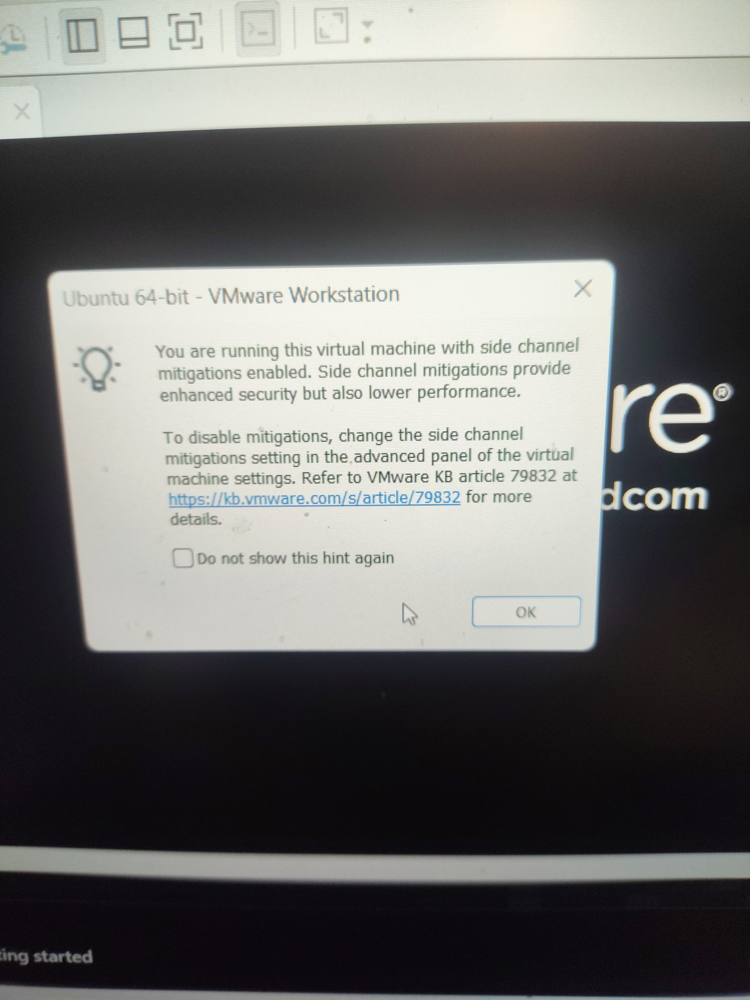
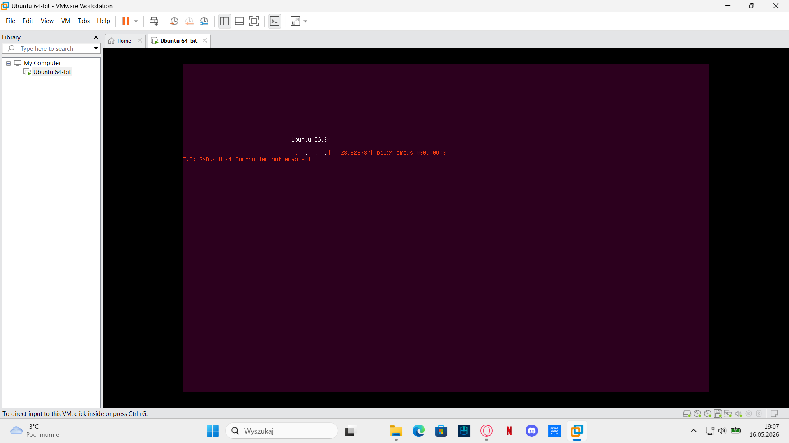

# Homelab

My personal homelab for learning IT infrastructure, virtualization, System administration, networking and cybersecurity fundamentals.

---

# Current Environment

## Host Machine
- Windows 11

## Virtualization
- VMware Workstation Pro

## Virtual Machines
- Ubuntu Linux

---

# What I Am Learning
- Linux
- Windows Server
- Networking
- Virtualization
- Git & GitHub
- Cybersecurity basics

---

# VMware Notes

## What I Learned
- Difference between NAT and Bridge networking
- Basics of virtual machines
- VM resource allocation
- Snapshots
- Host and Guest operating systems

---

# Ubuntu Installation

## VM Configuration
- 4 GB RAM
- 2 CPU cores
- 50 GB virtual disk
- NAT network

## Installation Notes
- Installed Ubuntu inside VMware Workstation Pro
- Used interactive installation
- Installed third-party software and drivers
- No disk encryption enabled

---

# Issues

## SMBus Host Controller not enabled

Ubuntu displayed an SMBus controller warning during boot inside VMware.

### What it means
- SMBus (System Management Bus) is used for communication with hardware sensors and controllers.
- In virtual machines this warning is usually harmless because the VM does not have direct access to physical motherboard hardware.

### Solution
- Waited for system startup
- Ubuntu booted normally
- 

- ## Side Channel Mitigations

VMware displayed a warning about side channel mitigations being enabled.

### What it means
- Side channel mitigations are CPU security protections related to vulnerabilities such as Spectre and Meltdown.
- They improve security but may slightly reduce virtual machine performance.

### Notes
- Left enabled during installation
- No issues observed during Ubuntu setup
- 

---

# Initial System Update

After installing Ubuntu I updated the system packages.

## Commands used

```bash
sudo apt update && sudo apt upgrade
```

## What I learned
- How package management works in Ubuntu
- Difference between update and upgrade
- Basic usage of sudo
- 

# Next Steps
- Linux terminal basics
- SSH
- Docker
- Windows Server installation
- Network configuration
- GitHub documentation
